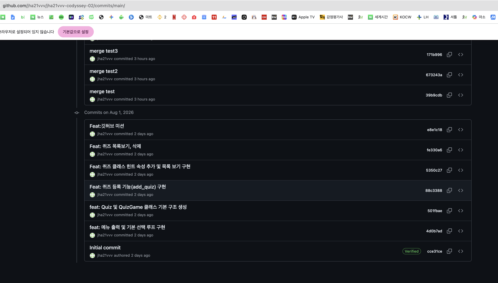
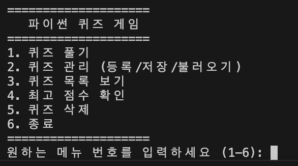
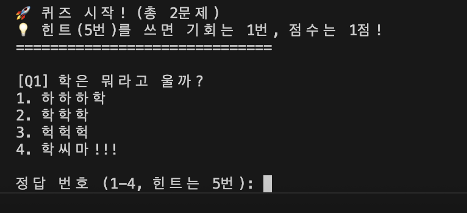

# 퀴즈 게임 프로젝트

## 1. 프로젝트 개요
- 파이썬 OOP를 활용한 콘솔 기반 퀴즈 프로그램입니다.

## 2. 퀴즈 주제 선정 이유
- 아무 생각 없어서 동물은 뭐라고 우나로 적음

## 3. 실행 방법
- 터미널에 'python main.py'입력

## 4. 기능 목록
- 깃 저장소 설정

## 5. 파일 구조
- main.py: 메인 실행 파일
- state.json: 데이터 저장 파일(퀴즈데이터, 최고 점수, 플레이 이력 전부)
- README.md: 관련 설명 데이터

## 6. 깃저장소 만들기
1. 새로운 저장소 만들기(https://github.com/jha21vvv/jha21vvv-codyssey-02)
2. 로컬에 저장소 만들기
``` bash
# 클론으로 제작
git clone https://github.com/jha21vvv/jha21vvv-codyssey-02.git
```

3. gitignore와 README.md만들기
- README.md는 1의 새로운 저장소 만들 때 기본 설정으로 만듬.
- .gitignore만들기는 아래 내용
``` bash
# Git이 추적하지 말아야 할 파일들을 적어주는 곳
__pycache__/
*.pyc
state.json
```
4. 첫번째 커밋과 푸쉬



## 7. 메뉴 기능
1. 메뉴 출력
2. 기능선택
3. 종료기능
4. 잘못된 명령 대응
5. 메뉴기능 완성후 커밋


## 8. 공통 입력 예외 처리
1. 숫자 입력: 앞뒤 공백 제거, 숫자 변환 실패 시 재입력, 허용 범위 밖 숫자 처리, 빈 입력 처리.
``` bash
def run(self):
    def get_safe_input(self, prompt, min_val=None, max_val=None):
        while True:
            try:
                user_input = input(prompt).strip() # 1. 앞뒤 공백 제거
                if not user_input: # 2. 빈 입력 처리
                    print("⚠️ 입력값이 없습니다. 다시 입력해주세요.")
                    continue
                
                val = int(user_input) # 3. 숫자 변환
                
                # 4. 허용 범위 밖 숫자 처리
                if min_val is not None and val < min_val:
                    print(f"⚠️ {min_val} 이상의 숫자를 입력하세요.")
                elif max_val is not None and val > max_val:
                    print(f"⚠️ {max_val} 이하의 숫자를 입력하세요.")
                else:
                    return val # 모든 조건 만족 시 반환
            except ValueError: # 5. 숫자 변환 실패 시 재입력
                print("⚠️ 숫자로만 입력해주세요.")
``` 
2. 비정상 종료 방지:** `Ctrl+C` (KeyboardInterrupt) 또는 `EOFError` 발생 시 안전하게 저장 후 종료.
``` bash
    try:
        while self.is_running:
            self.display_menu()
            choice = input("원하는 메뉴 번호를 입력하세요: ").strip()
            
            if choice == "1": self.play_quiz()
            # ... (나머지 elif 생략)
            elif choice == "6": self.exit_game()
            else: print("\n[오류] 1~6 사이의 숫자를 입력해주세요.")
            
    except (KeyboardInterrupt, EOFError): # Ctrl+C 또는 입력 종료 시
        self.exit_game()

def exit_game(self):
    print("\n\n[알림] 프로그램을 안전하게 종료합니다. 데이터를 저장합니다...")
    self.save_data() # 종료 전 자동 저장
    self.is_running = False
```
3. 데이터 복구: 파일이 없거나 손상 시 기본 퀴즈 데이터로 복구하여 실행 가능해야 함
``` bash
    def load_data(self):
        try:
            with open("quizzes.json", "r", encoding="utf-8") as f:
                data = json.load(f)
                if isinstance(data, dict):
                    self.high_score = data.get("high_score", 0)
                    quiz_data = data.get("quizzes", [])
                    self.quizzes = [Quiz(**q) for q in quiz_data]
                
                elif isinstance(data, list):
                    self.high_score = 0
                    self.quizzes = [Quiz(**q) for q in data]
                    
        except (FileNotFoundError, json.JSONDecodeError):
            # [요구사항 반영] 파일이 없거나 손상되었을 때의 복구 로직
            print("\n[! 데이터 복구] 파일이 없거나 손상되어 기본 퀴즈 데이터로 복구합니다.")
            self.high_score = 0
            # 기본 퀴즈 데이터 1개 제공 (사용자가 바로 게임을 테스트해볼 수 있게 함)
            self.quizzes = [
                Quiz("파이썬의 창시자는?", ["귀도 반 로섬", "제임스 고슬링", "데니스 리치", "빌 게이츠"], 1, "네덜란드 출신 프로그래머")
            ]
            # 복구된 데이터를 파일로 즉시 저장하여 다음 실행 시 오류 방지
            self.save_data()
```
## 9. 퀴즈클래스
1. 퀴즈클래스 정의
2. 선택지 4개
3. 퀴즈 출력, 정답 확인

``` bash
# 퀴즈 클래스
class Quiz:
    def __init__(self, question, choices, answer, hint):
        self.question = question
        self.choices = choices
        self.answer = answer
        self.hint = hint
class QuizGame:
# 생략
    def play_quiz(self):
# 생략
        for idx, quiz in enumerate(quiz_list, 1):
            print(f"\n[Q{idx}] {quiz.question}")
            for i, choice in enumerate(quiz.choices, 1):
                print(f"{i}. {choice}")
            user_ans = self.get_safe_input("\n정답 번호 (1-4, 힌트는 5번): ", 1, 5)
#생략
#채점 로직
                if user_ans == quiz.answer:
                    print("✅ 정답입니다! (힌트 사용: +1점)")
                    score += 1
                else:
                    print(f"❌ 틀렸습니다. 정답은 {quiz.answer}번이었습니다.")
            else: # 힌트 미사용 (바로 정답 입력)
                if user_ans == quiz.answer:
                    print("✅ 정답입니다! (+2점)")
                    score += 2
                else:
                    print(f"❌ 틀렸습니다. 정답은 {quiz.answer}번이었습니다.")
```

## 10. 기본 퀴즈 데이터 퀴즈 
1. 기본 퀴즈5개
2. 문제,선택지4,정답등 ([./state.json](./state.json))
``` bash
# 
```

``` bash
# 
```

### `Fix: 점수 계산 오류 수정`
## 7. 커밋과 푸시 기본
``` bash
# 1. 현재 폴더의 모든 변경 사항을 스테이징(준비) 영역에 올립니다.
git add .
# 2. 첫 번째 기록을 남깁니다. (메시지는 요구사항 권장 형식을 따랐어요)
git commit -m "init: 프로젝트 초기 구조 설정 (.gitignore, README, main.py)"
# 3. 내 컴퓨터의 기록을 GitHub(원격 저장소)로 보냅니다.
git push origin main
```

2. GitHub 미션 해결하기 (이미지 3번 내용)
이미지에 있는 **"최소 1회 이상의 브랜치 생성 및 병합"**과 "10개 이상의 커밋" 조건을 충족해야 합니다. 지금이 딱 브랜치를 연습해볼 타이밍이에요!

[미션: 브랜치 만들고 '퀴즈 풀기' 기능 구현하기]

새 브랜치 만들기: 터미널에 입력하세요.

bash
📋 복사
git checkout -b feature/play-quiz
일단 main에서 나가는코드 -b 새로운 ㅡ랜치(포스트잇만듬)

기능 구현 후 커밋: 퀴즈 풀기 기능을 만들면서 커밋을 쪼개서 해보세요. (예: "문제 출력 기능 구현", "정답 체크 로직 구현" 등) 이렇게 하면 10개 커밋 채우기가 쉽습니다.

병합(Merge)하기: 기능이 완성되면 다시 main으로 돌아가서 합칩니다.

bash
📋 복사
git checkout main
메인으로 브랜치이동
git merge feature/play-quiz
메인에 포스트잇()에 붙은 내용 옮겨 적음

### 기존에 메인에서 나와서 새로운 브랜치 만듬
jha21vvv5332@c6r6s2 jha21vvv-codyssey-02 % git checkout -b feature/play-quiz
Switched to a new branch 'feature/play-quiz'
### 브랜치 상황확인
jha21vvv5332@c6r6s2 jha21vvv-codyssey-02 % git branch
* feature/play-quiz
  main

### 수정후 내용 저장
git add .
git commit -m "merge test" 
# 오리진이란 서버로 보내는셈이라 오리진이라고 붙임
git push origin feature/play-quiz
### 메인으로 이동
jha21vvv5332@c6r6s2 jha21vvv-codyssey-02 % git checkout main
Switched to branch 'main'
Your branch is up to date with 'origin/main'.
### 브랜치이동 확인
jha21vvv5332@c6r6s2 jha21vvv-codyssey-02 % git branch       
  feature/play-quiz
* main
### 메인에 feature/play-quiz의 내용 옮겨 적기
jha21vvv5332@c6r6s2 jha21vvv-codyssey-02 % git merge feature/play-quiz
Already up to date.
jha21vvv5332@c6r6s2 jha21vvv-codyssey-02 % git branch                 
  feature/play-quiz
* main
jha21vvv5332@c6r6s2 jha21vvv-codyssey-02 % 


### 
### 

### 깃 풀 테스트>>> 당겨와봐1!!
