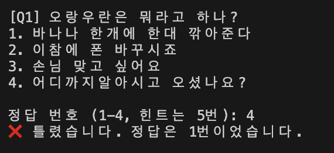
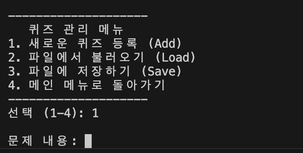
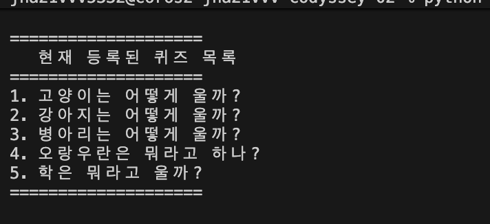
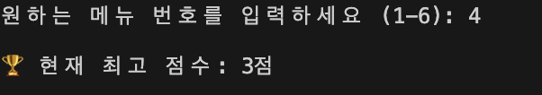
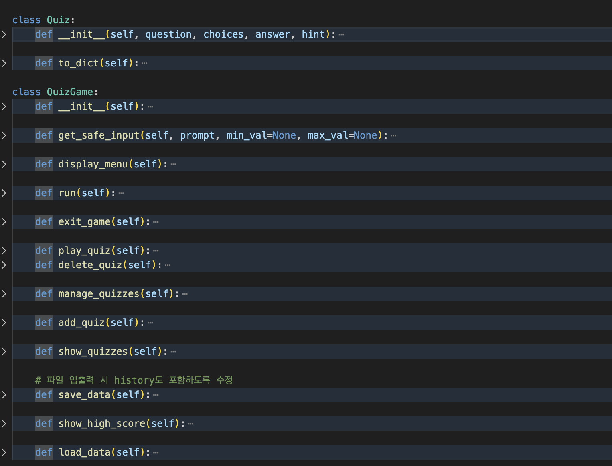
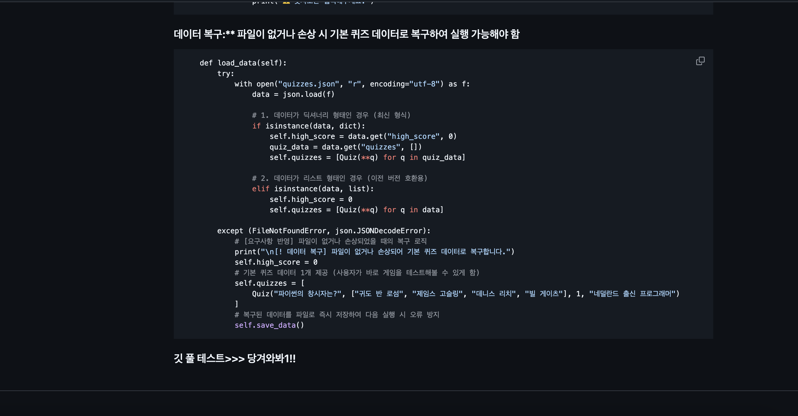
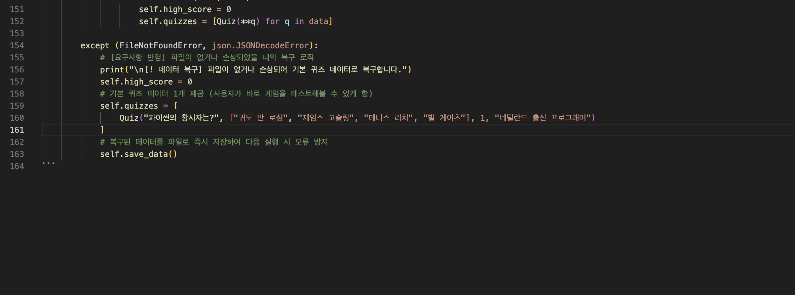
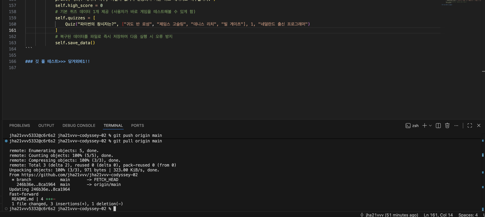
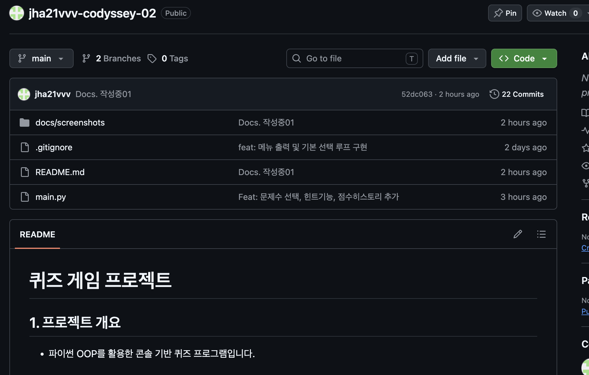
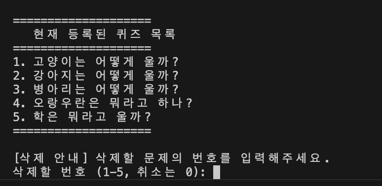

# 퀴즈 게임 프로젝트

## 1. 프로젝트 개요
- 파이썬 OOP를 활용한 콘솔 기반 퀴즈 프로그램입니다.

## 2. 퀴즈 주제 선정 이유
- 아무 생각 없어서 동물은 뭐라고 우나로 적음

## 3. 실행 방법
- 터미널에 'python main.py'입력

## 4. 기능 목록
- 깃 저장소 설정
- 메뉴기능 완료
- 공통기능 예외기능 입력
- 퀴즈 클래스 문제
- 기본 퀴즈 데이터
- 퀴즈 풀기 기능
- 퀴즈 추가 기능
- 퀴즈 목록 기능
- 점수확인기능
- 퀴즈 게임클래스  기능
- 퀴즈데이터 저장 , 불러오기 기능
- 리드미 작성
- 깃저장소 복제 연습
- 보너스: 랜덤 출제 기능
- 보너스: 문제수 선택 기능
- 보너스: 힌트기능
- 보너스: 퀴즈 삭제 기능
- 보너스: 점수히스토리 기능

## 5. 파일 구조
- main.py: 메인 실행 파일
- state.json: 데이터 저장 파일(퀴즈데이터, 최고 점수, 플레이 이력 전부)
- README.md: 관련 설명 데이터

## 6. 깃저장소 만들기
1. 새로운 저장소 만들기(https://github.com/jha21vvv/jha21vvv-codyssey-02)
2. 로컬에 저장소 만들기
``` bash
# 클론으로 제작
git clone https://github.com/jha21vvv/jha21vvv-codyssey-02.git
```

3. gitignore와 README.md만들기
- README.md는 1의 새로운 저장소 만들 때 기본 설정으로 만듬.
- .gitignore만들기는 아래 내용
``` bash
# Git이 추적하지 말아야 할 파일들을 적어주는 곳
__pycache__/
*.pyc
state.json
```
4. 첫번째 커밋과 푸쉬


## 7. 메뉴 기능
1. 메뉴 출력(출제, 둥록, 목록, 점수확인, 종료 가능)
2. 기능선택
3. 종료기능
4. 잘못된 명령 대응
5. 메뉴기능 완성후 커밋


## 8. 공통 입력 예외 처리
1. 숫자 입력: 앞뒤 공백 제거, 숫자 변환 실패 시 재입력, 허용 범위 밖 숫자 처리, 빈 입력 처리.
``` bash
def run(self):
    def get_safe_input(self, prompt, min_val=None, max_val=None):
        while True:
            try:
                user_input = input(prompt).strip() # 1. 앞뒤 공백 제거
                if not user_input: # 2. 빈 입력 처리
                    print("⚠️ 입력값이 없습니다. 다시 입력해주세요.")
                    continue
                
                val = int(user_input) # 3. 숫자 변환
                
                # 4. 허용 범위 밖 숫자 처리
                if min_val is not None and val < min_val:
                    print(f"⚠️ {min_val} 이상의 숫자를 입력하세요.")
                elif max_val is not None and val > max_val:
                    print(f"⚠️ {max_val} 이하의 숫자를 입력하세요.")
                else:
                    return val # 모든 조건 만족 시 반환
            except ValueError: # 5. 숫자 변환 실패 시 재입력
                print("⚠️ 숫자로만 입력해주세요.")
``` 
2. 비정상 종료 방지:** `Ctrl+C` (KeyboardInterrupt) 또는 `EOFError` 발생 시 안전하게 저장 후 종료.
``` bash
    try:
        while self.is_running:
            self.display_menu()
            choice = input("원하는 메뉴 번호를 입력하세요: ").strip()
            
            if choice == "1": self.play_quiz()
            # ... (나머지 elif 생략)
            elif choice == "6": self.exit_game()
            else: print("\n[오류] 1~6 사이의 숫자를 입력해주세요.")
            
    except (KeyboardInterrupt, EOFError): # Ctrl+C 또는 입력 종료 시
        self.exit_game()

def exit_game(self):
    print("\n\n[알림] 프로그램을 안전하게 종료합니다. 데이터를 저장합니다...")
    self.save_data() # 종료 전 자동 저장
    self.is_running = False
```
3. 데이터 복구: 파일이 없거나 손상 시 기본 퀴즈 데이터로 복구하여 실행 가능해야 함
``` bash
    def load_data(self):
        try:
            with open("quizzes.json", "r", encoding="utf-8") as f:
                data = json.load(f)
                if isinstance(data, dict):
                    self.high_score = data.get("high_score", 0)
                    quiz_data = data.get("quizzes", [])
                    self.quizzes = [Quiz(**q) for q in quiz_data]
                
                elif isinstance(data, list):
                    self.high_score = 0
                    self.quizzes = [Quiz(**q) for q in data]
                    
        except (FileNotFoundError, json.JSONDecodeError):
            # [요구사항 반영] 파일이 없거나 손상되었을 때의 복구 로직
            print("\n[! 데이터 복구] 파일이 없거나 손상되어 기본 퀴즈 데이터로 복구합니다.")
            self.high_score = 0
            # 기본 퀴즈 데이터 1개 제공 (사용자가 바로 게임을 테스트해볼 수 있게 함)
            self.quizzes = [
                Quiz("파이썬의 창시자는?", ["귀도 반 로섬", "제임스 고슬링", "데니스 리치", "빌 게이츠"], 1, "네덜란드 출신 프로그래머")
            ]
            # 복구된 데이터를 파일로 즉시 저장하여 다음 실행 시 오류 방지
            self.save_data()
```
## 9. 퀴즈클래스
1. 퀴즈클래스 정의(2개이상의 퀴즈 클래스 존재)
2. 선택지 4개
3. 퀴즈 출력, 정답 확인

``` bash
# 퀴즈 클래스
class Quiz:
    def __init__(self, question, choices, answer, hint):
        self.question = question
        self.choices = choices
        self.answer = answer
        self.hint = hint
class QuizGame:
# 생략
    def play_quiz(self):
# 생략
        for idx, quiz in enumerate(quiz_list, 1):
            print(f"\n[Q{idx}] {quiz.question}")
            for i, choice in enumerate(quiz.choices, 1):
                print(f"{i}. {choice}")
            user_ans = self.get_safe_input("\n정답 번호 (1-4, 힌트는 5번): ", 1, 5)
#생략
#채점 로직
                if user_ans == quiz.answer:
                    print("✅ 정답입니다! (힌트 사용: +1점)")
                    score += 1
                else:
                    print(f"❌ 틀렸습니다. 정답은 {quiz.answer}번이었습니다.")
            else: # 힌트 미사용 (바로 정답 입력)
                if user_ans == quiz.answer:
                    print("✅ 정답입니다! (+2점)")
                    score += 2
                else:
                    print(f"❌ 틀렸습니다. 정답은 {quiz.answer}번이었습니다.")
```

## 10. 기본 퀴즈 데이터 퀴즈 
1. 기본 퀴즈5개([./state.json](./state.json))
2. 문제,선택지4,정답등 ([./state.json](./state.json))
``` bash
# 퀴즈  생성
class QuizGame:
    def add_quiz(self):
        question = input("\n문제 내용: ")
        choices = [input(f"보기 {i}번: ") for i in range(1, 5)]
        hint = input("힌트 내용: ")
        try:
            answer = self.get_safe_input("정답 번호 (1-4): ", 1, 4)
            self.quizzes.append(Quiz(question, choices, answer, hint))
            print("[알림] 메모리에 추가되었습니다. 저장하려면 Save를 눌러주세요.")
        except ValueError:
            print("[오류] 숫자를 입력하세요.")
```


## 11. 퀴즈 풀기
1. 퀴즈 출제, 정답입력

2. 오답정답여부 출력

3. 새로운 브랜치 만들어서 작업, 브랜치 병합
``` bash
# 기존에 메인에서 나와서 새로운 브랜치 만듬
jha21vvv5332@c6r6s2 jha21vvv-codyssey-02 % git checkout -b feature/play-quiz
Switched to a new branch 'feature/play-quiz'
# 브랜치 상황확인
jha21vvv5332@c6r6s2 jha21vvv-codyssey-02 % git branch
* feature/play-quiz
  main
# 수정후 내용 저장
git add .
git commit -m "merge test" 
# 오리진이란 서버로 보내는셈이라 오리진이라고 붙임
git push origin feature/play-quiz
### 메인으로 이동
jha21vvv5332@c6r6s2 jha21vvv-codyssey-02 % git checkout main
Switched to branch 'main'
### 브랜치이동 확인
jha21vvv5332@c6r6s2 jha21vvv-codyssey-02 % git branch       
  feature/play-quiz
* main
### 메인에 feature/play-quiz의 내용 옮겨 적기
jha21vvv5332@c6r6s2 jha21vvv-codyssey-02 % git merge feature/play-quiz
```
4. 퀴즈가 없는경우 처리
5. 퀴즈 완료 후 결과 출력


## 12. 퀴즈 추가
1. 새로운 퀴즈등록, 정보 입력, 퀴즈 저장기능

``` bash
    def add_quiz(self):
        question = input("\n문제 내용: ")
        choices = [input(f"보기 {i}번: ") for i in range(1, 5)]
        hint = input("힌트 내용: ")
        try:
            answer = self.get_safe_input("정답 번호 (1-4): ", 1, 4)
            self.quizzes.append(Quiz(question, choices, answer, hint))
            print("[알림] 메모리에 추가되었습니다. 저장하려면 Save를 눌러주세요.")
        except ValueError:
            print("[오류] 숫자를 입력하세요.")

    def save_data(self):
        try:
            data = {
                "high_score": self.high_score,
                "history": self.history, # 히스토리 추가
                "quizzes": [q.to_dict() for q in self.quizzes]
            }
            with open("state.json", "w", encoding="utf-8") as f:
                json.dump(data, f, ensure_ascii=False, indent=4)
            # print("\n[시스템] 데이터가 state.json에 안전하게 저장되었습니다.")
        except Exception as e:
            print(f"\n[오류] 파일 저장 중 문제가 발생했습니다: {e}")
```
## 13. 퀴즈 목록 처리

``` bash
    def show_quizzes(self):
        print("\n" + "="*20)
        print("   현재 등록된 퀴즈 목록")
        print("="*20)
        
        if not self.quizzes:
            print("[!] 등록된 퀴즈가 없습니다.")
            return

        for i, quiz in enumerate(self.quizzes, 1):
            # quiz 객체에서 question 속성을 가져와서 출력
            print(f"{i}. {quiz.question}")
        print("="*20)

    # 파일 입출력 시 history도 포함하도록 수정
```
## 14. 최고 점수 매커니즘

``` bash
#최종점수 갱신 매커니즘
    def play_quiz(self):
        if not self.quizzes:
            print("\n[!] 등록된 퀴즈가 없습니다. 먼저 퀴즈를 등록해주세요.")
            return
        total_available = len(self.quizzes)
        print(f"\n현재 총 {total_available}개의 문제가 있습니다.")
        num_to_solve = self.get_safe_input(f"몇 문제를 푸시겠습니까? (1-{total_available}): ", 1, total_available)
        #생략
        #해당 부분
        if score > self.high_score:
            print(f"⭐ 최고 점수 갱신! ({self.high_score} -> {score})")
            self.high_score = score
#최고 점수 보는 메뉴
    def show_high_score(self):
        print(f"\n🏆 현재 최고 점수: {self.high_score}점")
```

## 15. 퀴즈게임 클라스


## 16. 퀴즈 저장 불러오기
``` bash
# 퀴즈 저장
    def save_data(self):
        try:
            data = {
                "high_score": self.high_score,
                "history": self.history, # 히스토리 추가
                "quizzes": [q.to_dict() for q in self.quizzes]
            }
            # utf-8ㄹㅎ 저장함
            with open("state.json", "w", encoding="utf-8") as f:
                json.dump(data, f, ensure_ascii=False, indent=4)
        #오류시 대응 
        except Exception as e:
            print(f"\n[오류] 파일 저장 중 문제가 발생했습니다: {e}")
    #퀴즈 데이터 불러오기
    def load_data(self):
        try:
            with open("state.json", "r", encoding="utf-8") as f:
                data = json.load(f)
                
                # 1. 데이터가 딕셔너리 형태인 경우 (최신 형식)
                if isinstance(data, dict):
                    self.high_score = data.get("high_score", 0)
                    self.history = data.get("history", []) # 히스토리 불러오기
                    quiz_data = data.get("quizzes", [])
                    self.quizzes = [Quiz(**q) for q in quiz_data]
                
                # 2. 데이터가 리스트 형태인 경우 (이전 버전 호환용)
                elif isinstance(data, list):
                    self.high_score = 0
                    self.history = []
                    self.quizzes = [Quiz(**q) for q in data]
        # [요구사항 반영] 파일이 없거나 손상되었을 때의 복구 로직        
        except (FileNotFoundError, json.JSONDecodeError):
            print("\n[! 데이터 복구] 파일이 없거나 손상되어 기본 퀴즈 데이터로 복구합니다.")
            self.high_score = 0
            self.history = []
            # 기본 퀴즈 데이터 1개 제공 (사용자가 바로 게임을 테스트해볼 수 있게 함)
            self.quizzes = [
                Quiz("파이썬의 창시자는?", ["귀도 반 로섬", "제임스 고슬링", "데니스 리치", "빌 게이츠"], 1, "네덜란드 출신 프로그래머")
            ]
            # 복구된 데이터를 파일로 즉시 저장하여 다음 실행 시 오류 방지
            self.save_data()
```
## 17. 깃저장소 복제와 풀 사용
``` bash
# 깃허브에서 클론으로 자료 들고 오기
git clone https://github.com/jha21vvv/jha21vvv-codyssey-02.git

#깃허브에서 바뀐 자료 풀로 로컬로 땡겨오기
git pull origin main
```
1. pull로 땡기기전 깃허브의 내용

2. pull로 땡기기전 로컬 화면

3. 풀로 떙긴 후 로컬 화면


4. 10개 이상(22개)의 커밋 만들기


## 18.랜덤 출제 기능 & 문제 수 선택 기능
``` bash
    def play_quiz(self):
        if not self.quizzes:
            print("\n[!] 등록된 퀴즈가 없습니다. 먼저 퀴즈를 등록해주세요.")
            return
        # 1. 문제 수 선택 기능
        total_available = len(self.quizzes)
        print(f"\n현재 총 {total_available}개의 문제가 있습니다.")
        num_to_solve = self.get_safe_input(f"몇 문제를 푸시겠습니까? (1-{total_available}): ", 1, total_available)

        # 문제 섞기 및 선택
        quiz_list = random.sample(self.quizzes, num_to_solve)
        score = 0

        #생략
        # 5. 점수 기록 히스토리 저장
        now = datetime.datetime.now().strftime("%Y-%m-%d %H:%M:%S")
        record = {
            "date": now,
            "num_questions": num_to_solve,
            "score": score
        }
```
## 19. 힌트기능


## 20. 퀴즈 삭제 기능


``` bash
    def delete_quiz(self):
        """퀴즈를 목록에서 삭제하고 state.json에 즉시 반영합니다."""
        # 1. 현재 등록된 퀴즈 목록을 먼저 보여줍니다.
        self.show_quizzes()
        
        # 2. 퀴즈가 하나도 없으면 삭제 과정을 진행하지 않습니다.
        if not self.quizzes:
            return

        # 3. 삭제할 번호 입력 받기 (get_safe_input 사용으로 안전함)
        # 0을 입력하면 삭제를 취소할 수 있도록 범위를 0부터 설정했습니다.
        print("\n[삭제 안내] 삭제할 문제의 번호를 입력해주세요.")
        choice = self.get_safe_input(f"삭제할 번호 (1-{len(self.quizzes)}, 취소는 0): ", 0, len(self.quizzes))

        if choice == 0:
            print("[알림] 삭제가 취소되었습니다.")
            return

        # 4. 선택한 퀴즈 삭제 (리스트 인덱스는 0부터 시작하므로 입력값에서 1을 뺍니다)
        removed_quiz = self.quizzes.pop(choice - 1)
        print(f"\n✅ [삭제 완료] 문제: '{removed_quiz.question}'")

        # 5. 중요: 삭제된 상태를 파일에 즉시 저장합니다.
        self.save_data()
        print("[시스템] 변경사항이 state.json에 안전하게 저장되었습니다.")score": score
        }
```